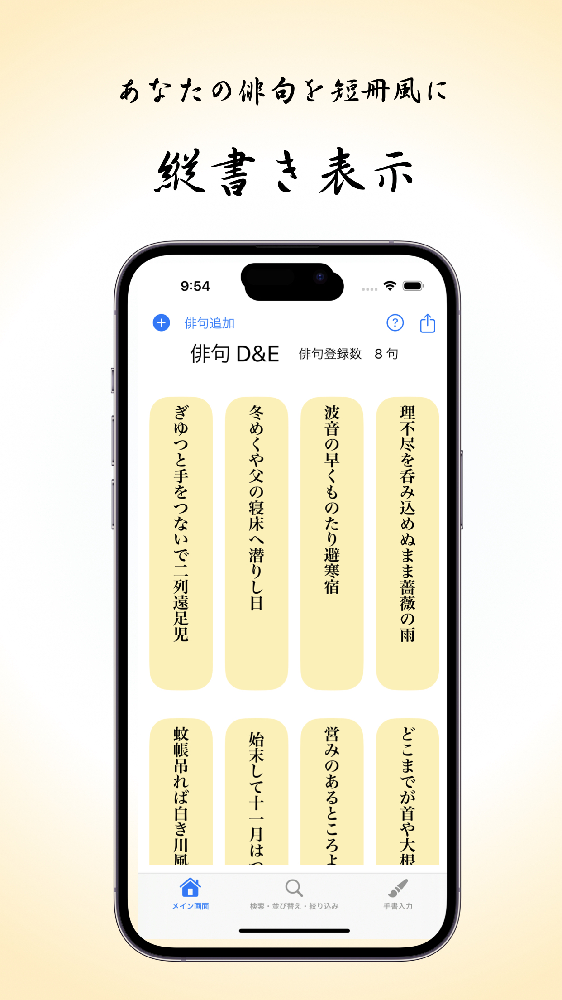
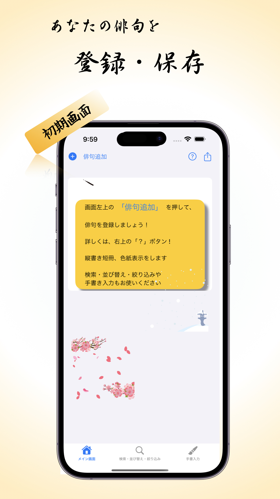
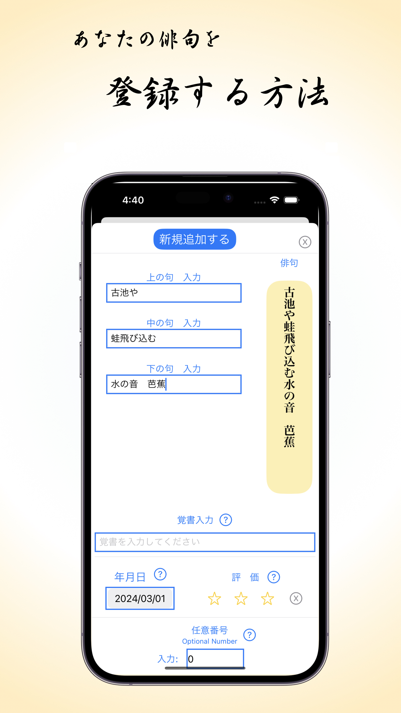
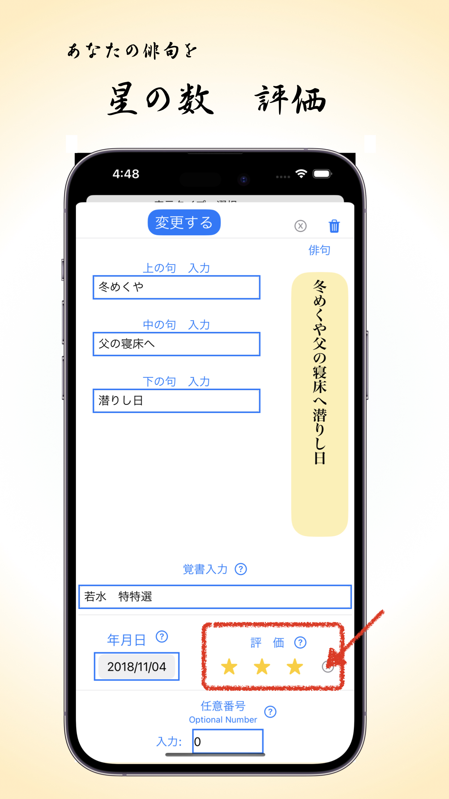
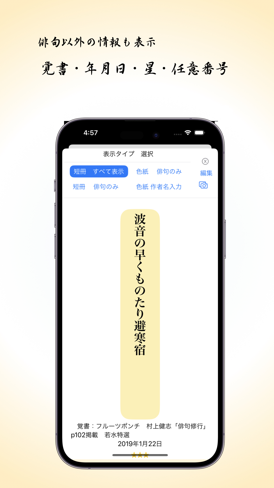
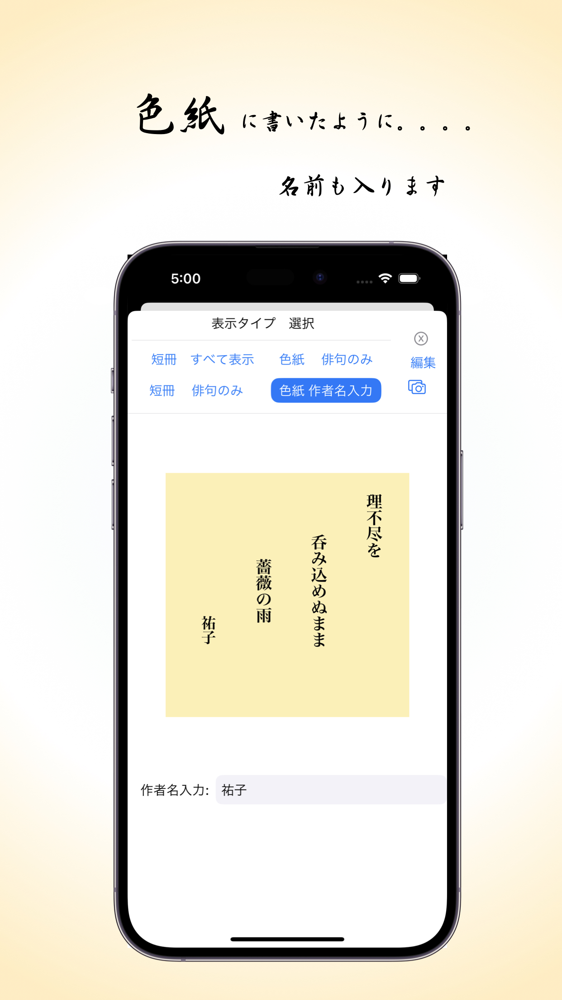
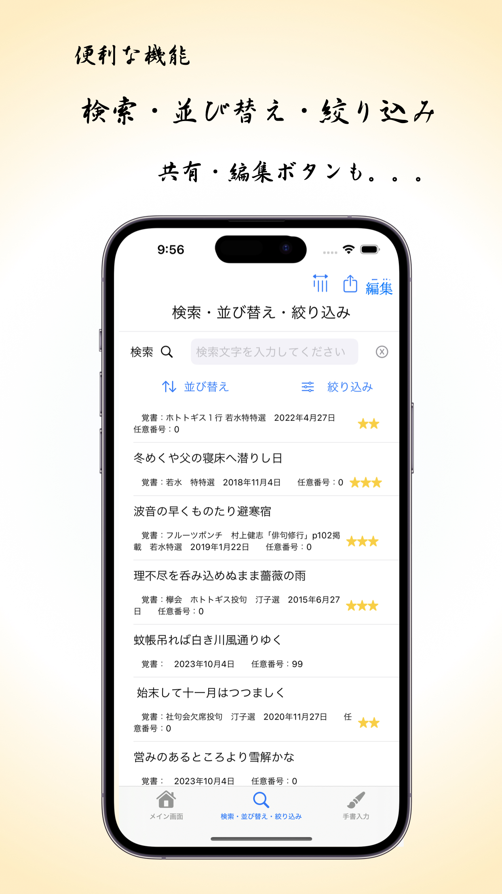
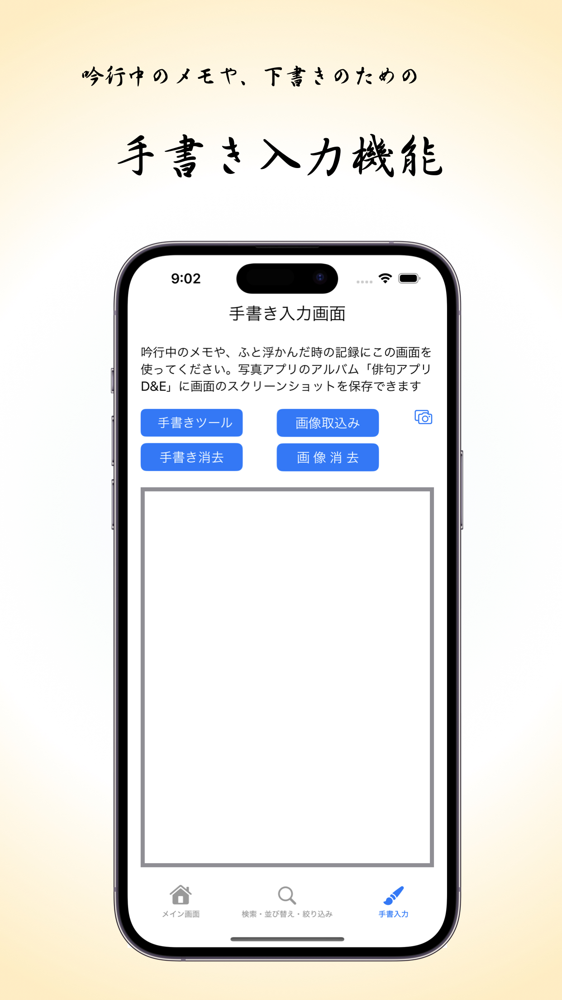

# アプリの説明

Haiku D&E とは？ (Develop ＆ Execute：俳句を創作し、このアプリを実行) 
　　　　
     [Q & A はこちら　](#a1)    

    以下の表示に不具合がある場合は、以下のアドレスへ「リンクを開く」でお願いします
    https://github.com/nakata-y/Haiku/blob/main/README.md
    (GithubアプリをiPhone/iPadにインストールなさってる方など )

    
    俳人もそうでない方も楽しめるアプリです 　　[アプリダウンロードはこちら](#a2) 

俳句を短冊に縦書き、手書風に、一覧表示します。

大切な句や句帳に眠っている句を登録してください。

短冊や色紙風に表示や共有ができ、登録句の検索や並び替や絞込みもできます

句ごとに評価の星をつけて、将来の句集作成に役立てて下さい

吟行中のメモや画像保存に手書入力画面も活用ください

俳人でない方も、覚えたい句を登録して、暗誦など活用ください。    [詳しい説明は、こちら](#詳しい説明)

*

（日々の使用例）
ふと俳句が浮かんだり、吟行中に写真撮影して、作句のヒントを手書きでメモし、
その後、作句したものを新規登録。句会結果を覚書に入力。

句会や句誌に投稿前に、選句したものを、新規登録。句会結果を覚書に入力。

句帳に溜まっている俳句を登録。将来の句集作成の元データとする。

登録した句を短冊や色紙風に表示し、友人やSNSへ共有して、日々楽しむ。

登録後も、例えば、好きな順に表示順を変更して、楽しんだり、将来の句集作成の参考に。

主な機能：
* 俳句の一覧表示：短冊や色紙風のデザインで、あなたの俳句を美しく表示します。
  
* 句の登録と管理：句帳の句を簡単に登録し、検索や並び替え、絞り込みも可能です。将来の句集作成の元データとしてください。
  
* 評価とメモ：各句に星評価を付け、手書き入力画面で吟行中のアイデアや画像を保存できます。
  
* 共有機能：作成した俳句をSNSや友人と簡単に共有できます。
  
* 詳細なQ&A：アプリの使い方に関する疑問は、Q&Aセクションで解決できます。
  
使用例：
* ふと思いついた俳句を登録し、句会の結果をメモ。
  
* 句会や句誌への投稿前に、選んだ句を新規登録。
  
* 句帳にある句を登録し、将来の句集作成に活用。
  
* 登録した句を短冊や色紙風で表示し、日々楽しむ。

よくある質問：

* アプリの使用開始方法：画面下部のアイコンをタップして、メイン画面、検索、手書き入力画面を利用できます。
  
* 新規登録と評価：メイン画面右上の「俳句追加」から新規登録が可能。各句には星評価を付けられます。
  
* カスタマイズとバックアップ：俳句の並び順の変更や、登録データのバックアップも簡単です。
  俳人でなくても楽しめる！
  
* お気に入りの俳句を登録し、暗唱や記憶力アップに利用できます。
  
* 散歩中にアプリをチェックして、名句を心に刻みましょう。

 
##　Q & A

▶︎　Q　の　▶︎をクリックして下さい。 Aが出てきます
ーーーーーーーーーーーーーーーーーーーーーーーーーー

Q　以下のQ & A　の説明の通りしてもうまくいかない　
　

A　 iOSを最新にアップデートをお願いいたします。それで解決したとの報告をいただいてます。

Q　 初めてこのアプリを使いますか？　
　
はい、画面の下部に３つのアイコンをタップしてみてください。
「メイン画面」「検索・並び替え・絞り込み」「手書き入力」の3つの画面は切替わります
それぞれの画面について説明していきます。

Q　「メイン画面」は？　新規登録の方法は？
ーーーーーーーーーーーーーーーーーーーーーーーーーー
俳句を新規登録したら、上記のように、短冊に手書きしたように、一覧表示します。
初期画面は、以下の通りです。

*
A. メイン画面右上の「+ 俳句追加」ボタンをタップ。
入力画面　下からシートが出てきます。　

俳句の上の句、下の句、中の句と分けて入力
分けて入力するのは、色紙風に表示するときのためです　＝＝＞　下の色紙風画像参照ください

そのほかの項目の覚書・年月日・星の数・任意番号は、全て任意入力です
（入力画面の各項目の「？」を押すと、説明も出てきます
 説明を閉じるのは、「x」を押すか、半透明の黒背景をタップすると非表示になります）

Q.覚書とは？　　
　
何か記録しておきたいものを、入力。入力は必須ではありません。
(例)句会の名前や、句会での評価等。また、自分の句でないときは自由に入力ください。
作者名を入力する欄はないので、ここに作者名を入力してくださっても。
覚書は、メイン画面に表示しないので、メイン画面に作者名を表示したい場合は、
下の句につづけて、作者名を入力くだされば、表示されます。
   

Q年月日とは？　
　

選択しなければ、アプリに登録した年月日となります
年月日を作成日等に変更したい場合は、選択してください。

Q　俳句の評価を星の数でするには？　  
　

A　クリックして評価？星とは？
評価したい星の数をクリック
指定しない場合は、星の数は０です。
星の数は３つまで設定できます。
星の数をキャンセルして、０に戻す場合は、星の右側の「x」マークをクリックください。

例えば、是非句集に入れたい句には、星３つ。
迷うものは、星１つ等、お好きなように星を使ってください。

Q　 任意番号とは？　　
　
独自に割り当てたい任意の番号があルカたは、この欄をお使いください。
入力は必須ではありません。
指定しない場合は、０です。
(例）登録順を付番したい、句集に入れる順番を付番したい方は、な任意番号を使って下さい。
                                    

 入力が完了し画面上部の　青い「新規追加追加する」ボタンをタップして、登録して下さい。

「メイン画面」のすでに登録されている句の最後に追加登録されます。

 入力を中止して、登録をしない場合は、右上の「x」を押して下さい。メイン画面に戻ります。

Q　一句だけ詳細表示　
　

A　短冊風の縦書きの俳句をタップすると、
その句だけ表示する画面が下から出てきます。
画面上部に。「内容の変更」「俳句のみ表示」カメラマーク、「x」が表示され、
選んだ一句だけ短冊風に表示されます

Q　「内容の変更」　登録した内容を変更できますか？　
　

A　 はい。
メイン画面で、変更したい俳句をタップすると、その俳句の詳細情報が表示されます。
「変更する 」　ボタンをタップください

Q　登録した句は削除できますか？　  
　

A　はい。
 「メイン画面」で、削除したい俳句をタップする。
「内容の変更」をタップ
　「ゴミ箱」ボタンをタップしたら、俳句をアプリから削除することができます。

別法） 画面下部にある「検索・並び替え・絞り込み」をタップ
　　　右上の編集ボタンをタップ
     　 削除したい句の左の赤の「ー」を押す

Q　「俳句のみ表示」　短冊や色紙風の楽しみ方？
A　４つの選択肢（俳句のみ表示、全て表示、色紙、色紙　作者名入り）メニューを選択ください。

Q　色紙風？　
　
「色紙　作者名入り」選び名前を入力すれば、色紙に名前も入ります。
（注意）登録の際、上の句、中の句、下の句に入力された通り、色紙に３行分かれて表示します。
 また、右上のカメラマークをタップすると、写真アプリの写真にスクショが保存され　＆アルバム「俳句　D&E」にも入ります。
例えば、メイン画面で俳句を選びタップ→俳句のみを表示をタップ→ 色紙　作者名入りをタップ　→  作者名を入力　→
カメラマークをタップして、スクショを写真アプリに保存->
写真アプリで不要な部分を切り取るなど編集して、SNSにアップしたり、友人にLineしたり楽しめます。

Q　「カメラマーク」　
　

A　「カメラマーク」をタップすると、写真アプリの写真にスクショが保存され、かつ、アルバム「俳句　D&E」にも入ります。

Q　「x」　 
　

A　入力を中止して、登録をしないときは、「x」を押して下さい。メイン画面に戻ります。

Q    登録した俳句の並び順を変更できますか？  
　

A　移動したい俳句をタッチして押さえたままにして、持ち上がるまで待ちます。
別の場所にドラッグします。
ドラッグ中、俳句をドロップできる場所に　緑の＋マークが表示されます。
移動したいところで、手を離します。
      　上部の「内容の変更 」　ボタンを押したら、　変更画面が表示。 変更したい部分を修正して、「変更」ボタンを押したら、変更されます。

参照）　iPadでドラッグ＆ドロップして項目を移動およびコピーする
https://support.apple.com/ja-jp/guide/ipad/ipadaa83b207/ipados

うまくいかない時は、、「検索・並び替え・絞り込み」の画面の右上の「編集」を押して、順番の変更や削除をして下さい。

Q 「メイン画面」の右上の「？」ボタン　ヘルプページへの簡単なアクセス。　
　

A わからなくなったら、「？」ボタンをタップください。

*****

Q　 「検索・並び替え・絞り込み」？　　
　
ーーーーーーーーーーーーーーーーーーーーーーーーーー
A　 画面下部にある「検索・並び替え・絞り込み」をタップしてください。

保存されている俳句を検索バーを利用して検索したり、並び替えたり、特定の条件で絞り込むことができます。
俳句のほかに、覚書、日付、星の数、任意の番号も、横書きで表示されます。
 検索バーに検索ワードを入力ください。

Q並び替えの仕方は？　
　
 A　 「並び替え」をタップし、「並び替え」変更」をタップすると、
　　　複数の並替の条件の選択項目が、表示されます。選択ください。

Q　絞り込みの仕方は？　
　
A    「絞り込み」と表示されたボタンをタップすると、詳細な絞り込みの画面へ。
 もし既に絞り込みの条件が設定されている場合、その条件に応じて「期間 絞込中」、「星の数 絞込中」、「任意番号 絞込中」といった黄色のラベルが表示されます。

Q   期間指定: 期間を指定する　
　
A   開始日と終了日のカレンダーから日付を選択することができます。

Q　星の数を指定
　
A  星の数を0から3までの間で選択することができます。
       条件をクリアするしたいときは「x」ボタン。

Q　任意番号指定　
　
A  2つの数字を任意で入力することができます。

Q　「カメラマーク」　
　
A  タップすると、写真アプリの写真にスクショが保存され、かつ、アルバム「俳句　D&E」にも入ります。

Q　検索・並び替え・絞り込み」画面の右上 の３つのボタンは？　
　
Q　縦書き表示
A  縦書きに表示を変更
俳句のみ、または、全て表示を選択できます

Q　「カメラマーク」
A  タップすると、写真アプリの写真にスクショが保存され、かつ、アルバム「俳句　D&E」にも入ります。

 
Q　編集（削除・移動）：　右上の編集ボタンを押してください。
A   並び替え・絞り込みをしているときは、右上の編集ボタンを押しても、編集（削除・移動）できません。編集をしたい場合は、並び替え・絞り込みをやめてください。

*****
Q　 「手書き入力」画面は？
ーーーーーーーーーーーーー

A   画面下部にある「手書入力」をタップすると、

Apple Pencilや指で手書きができます。
また、写真アプリから画像を取込みができます。
（取込んだ画像は、画質が落ちる場合があります）

保存ボタンを押せば、写真アプリの　アルバム「俳句　D&E」に　スクショが保存されます。

Q　「手書きツール」　
　
A  下から、ツールが出てきます。
  

 Q　「画像取込み」　
　
A  写真アプリが表示され、選択すると、手書入力画面に取り込まれます
   

 Q  「スクリーンショット保存」　
　
A   写真アプリの　アルバム「俳句　D&E」に　スクショが保存されます。
     

Q　 「手書き消去」　
　
A  入力した手書きを全て消去します。
 

Q　「画像消去」　
　
A  　取込んだ画像を消去します。
 

  
  

Q　 句会の前後でこのアプリを利用できますか？　
　

A   投句をアプリに登録して、結果を覚書に入力（〇〇句会で特選。△誌p１５６に掲載。
　　年月日を句会日に変更したければ、変更。
　　お気に入りの星を設定するなら、星をタップ。
　　削除したい句は、削除。

Q　登録データーをもとに句集は作れますか？　
　
A   共有ボタンで、他のアプリ（メモ帳など）へテキストデータを書き出して、出版社の方に渡してください。

全部だと多い場合は、「絞り込み」機能をで、絞り込んで、共有ボタンを押して下さい。
例えば、「星２つ以上を句集に載せる場合は、星２から３で絞り込む」などです。

作句の古い順に並べたい場合は、年月日を作句日にして（年月日は修正しないと、登録日です）、「並び替え」機能で
並び替えた上で、共有ボタンを押して下さい。

Q　 句会休会のときの欠席投句にこのアプリは使えますか？　 
　
A   いろいろ方法がありますが、例えば、
　* 欠席者がこのアプリに　投句を登録。
   * 検索・並び替え・絞り込み　のページ の右上 の縦書きボタンを押す
   * 画面右下のカメラマークをタップして、フォトライブラリへの保存。
   * 上記をメールやLineで出席者へ送付。
   * 出席者は、２枚印刷して、１枚は投句控え。もう１枚は、切って短冊に。
      書写しの間違えも無しで、手間も要らずです。

Q　作者名の入力欄はどこですか？　
　

A  ご自分の句を登録するアプリなので作者入力欄はありませんが、
　　下の句に続けて　作者名を入力すると、
 　 メイン画面に作者名が表示されます。
　　
   覚書に入力すると、メイン画面に作者名は表示されないので、作者名を覚えたいときなどは、こちらがいいかと思います。

Q  登録データのバックアップはどうすれば？　
　
システム障害等で俳句アプリのデータが消えたり、他のアプリで利用したいときのは、

A   画面下部にある「検索・並び替え・絞り込み」  >　 右上の共有ボタン

テキストデータで書き出せます。
登録データのバックアップに利用ください、
システム障害等で俳句アプリのデータが消えたり、他のアプリで利用したいときのために。

俳人ではないですが、このアプリで楽しめますか？　 　

A   勿論です！覚えたい句や時々思い出したい句を登録して、暗誦など活用ください　

　　　　俳句を作らない方も、好きな名句や忘れたくない句を保存して、楽しんでください。

　　　　例えば散歩しながら、アプリをチェックし、名句を記憶すれば、
    
　　　　記憶力アップ！（ただ歩くより足し算をしたり、何か覚えながら歩く方がいいそうです）
    
　　　　にどうでしょう？

作者名は、下の句に続けて入力するか、覚書に入力ください。

本来、ご自分の句を登録するアプリなので作者入力欄はありません下の句に続けて　作者名を入力すると、

メイン画面に作者名が表示されます。

 覚書に入力すると、メイン画面に作者名は表示されないので、作者名を覚えたいときなどは、こちらがいいかと思います。

ーーーーーーーー
 
## ダウンロード

 
